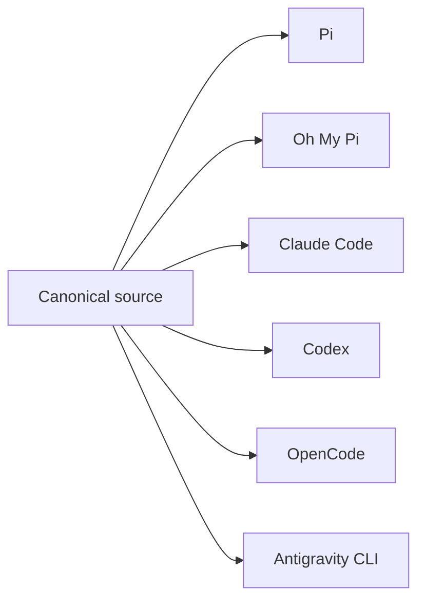

# SyncAI

[](https://github.com/jsmestad/syncai/actions/workflows/ci.yml)
[](https://github.com/jsmestad/syncai/releases/latest)
[](LICENSE)

**Write your AI configuration once. Keep every coding agent in sync.**

The better your coding-agent setup gets, the harder it becomes to use anywhere else. Agent prompts, tool permissions, model roles, reusable skills, shared instructions, extensions, and package manifests become part of how you work, but every coding agent stores those ideas in different formats and locations.

Copying configuration between tools creates a fork every time. Improvements land in one agent but not the others, translations lose intent, and local edits drift until no version is clearly authoritative.

SyncAI makes the setup yours. Keep one canonical source tree, validate it once, and render deterministic native configuration for Pi, Oh My Pi, Claude Code, Codex, OpenCode, and Antigravity CLI. When an installed file changes, `status`, `import`, and `pull` bring that change back into the workflow instead of silently overwriting it.



## Why do I need this?

### Improve one agent, keep every target current

You tune the `reviewer` agent while working in Pi. That improvement now lives only in Pi unless you manually translate it into every other agent's format.

```bash
syncai status --scope home
syncai pull reviewer --scope home
```

`status` shows the installed edit. `pull` moves supported changes back into `ai-source/` and immediately rerenders every configured target, so the Claude Code, Codex, OpenCode, Oh My Pi, and Antigravity versions do not become stale copies.

### Keep a Pi extension as source, not machine state

You write `session-notes.ts` directly in Pi. You want it to survive a new laptop, a clean install, or an accidental local deletion. Import it into the canonical tree, then render it like every other managed resource:

```bash
syncai import
syncai import session-notes
syncai render --scope home
```

The first command lists importable resources without changing anything. The second copies the supported single-file extension into `ai-source/extensions/`. Future renders restore it to Pi wherever that source tree is used. The extension remains Pi-only because its TypeScript runtime is not portable to the other tools.

### Change model providers without rewriting agents

You switched from an Anthropic subscription to OpenAI. Your agent definitions should not care. Define `claude` and `openai` profiles once in `model-profiles.json`, keep semantic roles such as `code-fast` and `code-high` in the agent files, then switch the active profile:

```bash
syncai render --out "$(mktemp -d)" --profile openai --scope home
syncai use-profile openai --scope home
```

The first command gives you an isolated preview. The second renders the OpenAI mappings and persists the selection atomically. Profile-driven Pi, Oh My Pi, and OpenCode agents switch together; fixed vendor mappings for Claude Code, Codex, and Antigravity remain unchanged.

### Try another coding agent without rebuilding your setup

You spent months refining your Claude Code agents and skills. Now you want to try Codex or OpenCode without rebuilding that setup. Add the compatible target to the canonical resource once, then preview the native output before installing it:

```bash
PREVIEW="$(mktemp -d)"
syncai render --out "$PREVIEW" --scope home
syncai render --scope home
```

The preview shows exactly what each tool will receive. The home render writes the supported agents, skills, instructions, and package metadata to their native locations. Target capabilities differ, so SyncAI renders only what each tool can represent instead of pretending every format is interchangeable.

### Keep personal and work configuration in one source tree

Your personal setup uses experimental models and broad tool access. Work requires different agents, model mappings, packages, and instructions. Mark resources as `home`, `work`, or universal, then render the scope for that environment:

```bash
syncai render --scope home
syncai render --scope work
```

Scope-specific resources and model overrides change without duplicating the shared configuration. In practice, run the matching command on each machine or environment rather than maintaining separate source trees that drift apart.

### Put an existing hand-maintained setup under source control

You already have useful agents and skills scattered across Pi, Claude Code, and Codex. Ask SyncAI what it can safely recover before moving anything:

```bash
syncai import
syncai import --all
syncai validate
```

The first command is an inventory. `--all` imports resources with a supported, unambiguous conversion, and `validate` checks the resulting canonical source. Lossy or tool-specific fields are left for explicit review instead of being silently guessed.

## Quick proof

Prerequisite: Go 1.25 or 1.26 and a checkout of this repository. This entire example installs and renders beneath one temporary directory. It does not write to your home configuration or SyncAI state manifest.

```bash
SYNCAI_ROOT="$(mktemp -d)"
mkdir -p "$SYNCAI_ROOT/bin" "$SYNCAI_ROOT/rendered"
GOCACHE="$SYNCAI_ROOT/go-build" GOMODCACHE="$SYNCAI_ROOT/go-mod" GOBIN="$SYNCAI_ROOT/bin" go install ./cmd/syncai
"$SYNCAI_ROOT/bin/syncai" validate --source examples/complete --profile openai
"$SYNCAI_ROOT/bin/syncai" render --source examples/complete --out "$SYNCAI_ROOT/rendered" --profile openai
for target in .pi .omp .claude .codex .config/opencode .gemini/antigravity-cli; do test -d "$SYNCAI_ROOT/rendered/$target" && printf '%s\n' "$target"; done
```

The final command prints all six target roots:

```text
.pi
.omp
.claude
.codex
.config/opencode
.gemini/antigravity-cli
```

Use `--scope home` or `--scope work` to select scoped agents, skills, extensions, package settings, and environment model overrides. Omit `--out` only when you are ready to render into your home directory.

## Install

```bash
go install github.com/jsmestad/syncai/cmd/syncai@latest
```

SyncAI defaults to `ai-source/` and renders to `$HOME`. Start with `syncai validate`, inspect an isolated render with `syncai render --out "$(mktemp -d)"`, then read the [command safety reference](docs/commands.md) before rendering into your home directory.

## What one source tree controls

| Canonical resource | Pi | Oh My Pi | Claude Code | Codex | OpenCode | Antigravity CLI |
| --- | --- | --- | --- | --- | --- | --- |
| Agents | Yes | Yes | Yes | Yes | Yes | Yes |
| Skills | Yes | No | Yes | Yes | No | Yes |
| Shared instructions | Yes | No | Yes | Yes | Yes | No |
| TypeScript extensions | Yes | No | No | No | No | No |
| Package and plugin inventory | Yes | No | Yes | Yes | No | Yes |

Agents use semantic roles such as `exploration` and `review` instead of embedding one provider model in every prompt. Toggleable profiles select model maps for Pi, Oh My Pi, and OpenCode. Fixed maps hold vendor-specific models for Claude Code, Codex, and Antigravity. `home` and `work` overlays can replace individual role mappings without duplicating whole profiles.

SyncAI also supports reversible workflows:

- `status` reports tracked edits, missing files, stale outputs, untracked agents, untracked skills, and Pi extension drift.
- `import` promotes untracked Pi, Claude, and Codex agents, skills, and single-file Pi extensions into canonical source when the conversion is supported.
- `pull` moves supported edits from rendered files back to their canonical agent or extension, then redistributes them.
- The default home render refuses to overwrite unreconciled manifest-tracked edits unless you pass `--force`.

Reverse conversion is intentionally bounded. Agent bodies and descriptions round-trip broadly. Tool and model fields round-trip only where the native format preserves enough information. OpenCode permission maps, unsupported frontmatter, ambiguous models, and directory extension imports require a manual source edit. See [Commands](docs/commands.md#import-and-pull-limits).

## SyncAI and Vercel Labs Skills

[Vercel Labs Skills](https://github.com/vercel-labs/skills) focuses on discovering, installing, using, updating, and removing Agent Skills across 77 agents, including “OpenCode, Claude Code, Codex, Cursor, and 73 more,” using symlink or copy installation and the Agent Skills format. SyncAI manages a broader canonical configuration and renders each supported tool's native files.

| Capability | SyncAI | Vercel Labs Skills README |
| --- | --- | --- |
| Discover, install, update, and remove Agent Skills | Not a registry workflow | Documented |
| Agent Skills compatible directories | Rendered to four supported skill roots | Documented across 77 agents |
| Canonical vendor-specific agent rendering | Six native agent targets | Not documented |
| Reverse pull of installed edits into canonical source | Supported within documented conversion limits | Not documented |
| Import of installed vendor configuration into canonical source | Supported within documented conversion limits | Not documented |
| Semantic model profiles and environment overlays | Supported | Not documented |
| Manifest-backed installed drift guards | Supported for default home renders | Not documented |

“Not documented” describes the current upstream README, not a claim that the project can never support the capability.

## Pi integration

SyncAI generates agent definitions compatible with [`@tintinweb/pi-subagents`](https://github.com/tintinweb/pi-subagents). Install that Pi extension separately:

```bash
pi install npm:@tintinweb/pi-subagents
```

The extension owns subagent execution and its runtime behavior. SyncAI does not author, bundle, or replace it. SyncAI generates compatible model, thinking, skill, prompt-mode, and tool configuration, but it does not currently render the upstream `allowed_subagents` field required to configure nested subagents. See [Pi integration](docs/pi.md).

## Reference

- [Canonical source format](docs/source-format.md)
- [Commands, output, exit behavior, and safety](docs/commands.md)
- [Pi integration](docs/pi.md)
- [Contributing](CONTRIBUTING.md)
- [Security policy](SECURITY.md)

SyncAI is licensed under the [Apache License 2.0](LICENSE).
